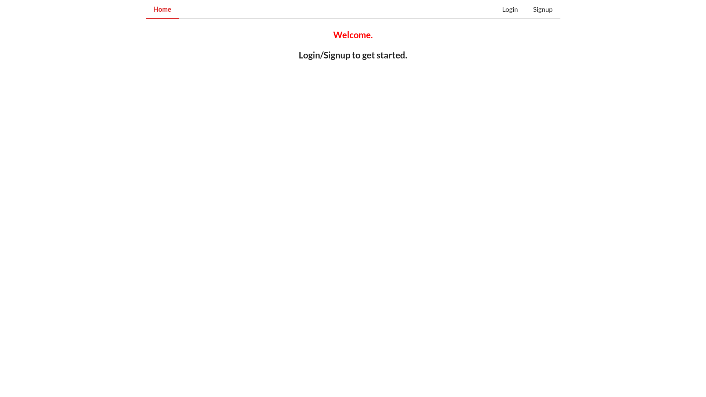
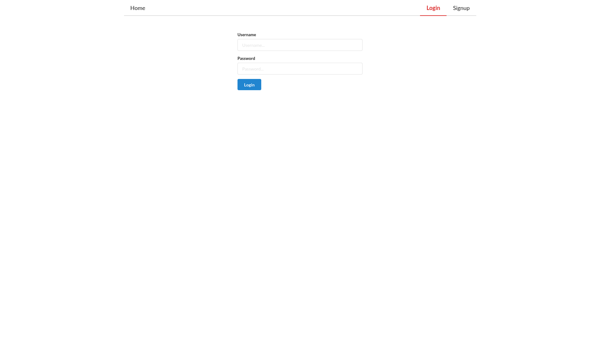
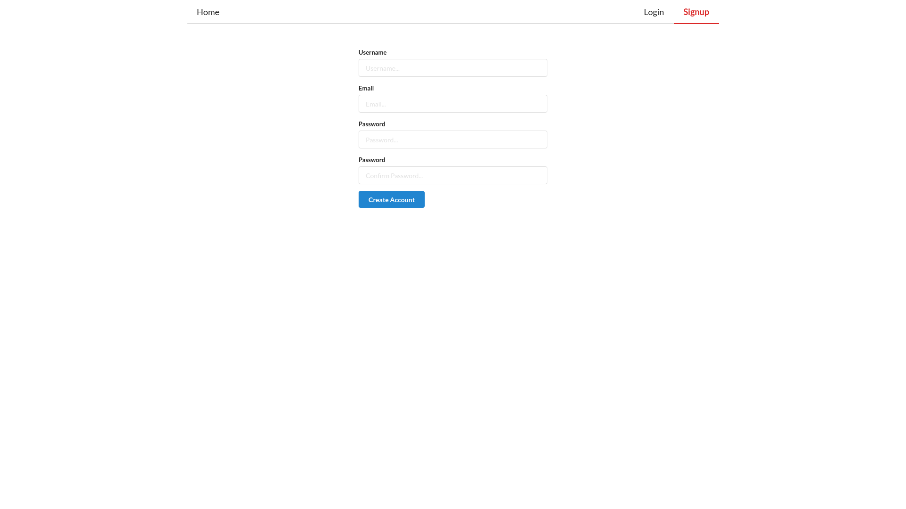
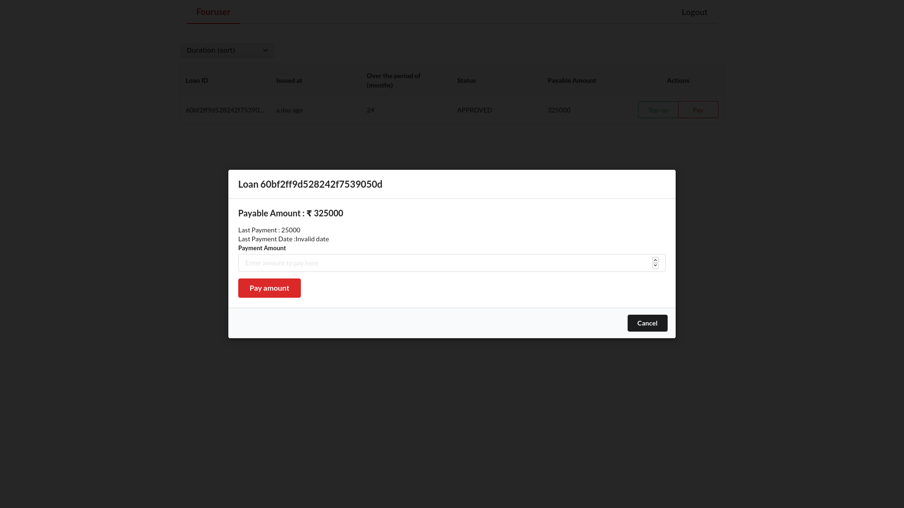
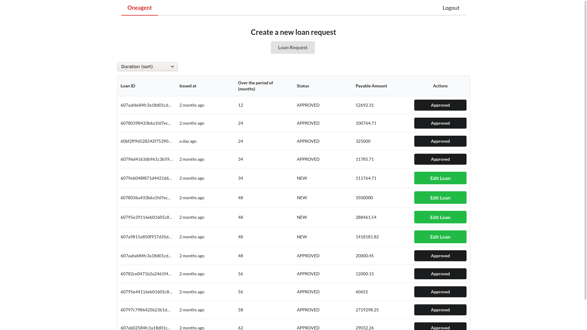
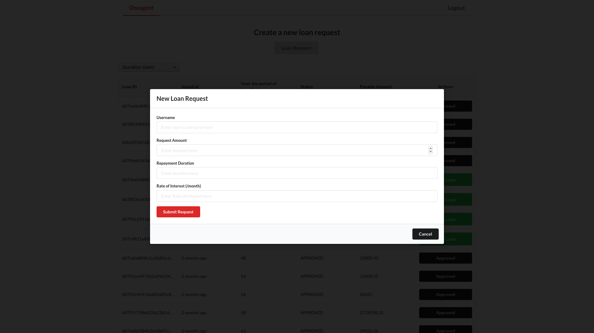
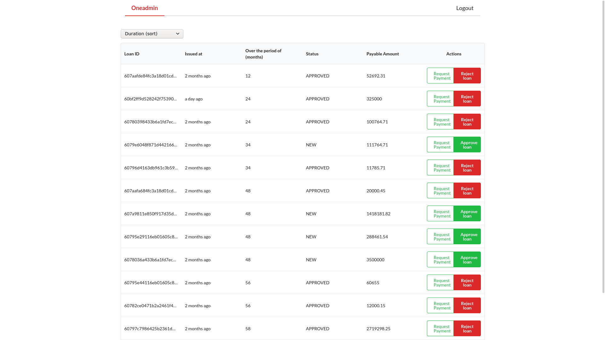

# Minimal Loan Management App

## About The Project

This app is a full stack minimal loan management system. You can sign up/register for a user account, payment of your loan(s) will be done after the same is created by the agent and approved by the admin.

### Built With

These are the major frameworks that I built this project using.

-   [MongoDB](https://www.mongodb.com/)
-   [ExpressJS](http://expressjs.com/)
-   [ReactJS](https://reactjs.org)
-   [NodeJS](https://nodejs.org/en/)
-   [GraphQL](https://graphql.org/)
-   [Apollo GraphQL](https://www.apollographql.com/)
<!--
   list/view users - agent/admin
   edit users - agent/admin

loan request - agent

approval of loan - admin

edit loan (if not approved) - agent

list/view loans by filter - user/agent/admin - date of creation - date of update - state of the loan
-->

## Features

1. Authentication/Authorization System

2. Query Database

    ```GraphQL
    query{
       listUsers (isAgent, isAdmin)
       getMyLoans(userid, isAgent)
    }

    ```

3. CRUD Operations

    ```GraphQL
    mutation{
       createLoan (username, amount)
       approveLoan (loanid, isAdmin)
       editUsers (username, isAgent, isAdmin)
       editLoan (loanid, isAgent, loanStatus)
    }
    ```

## App Roles

1. Admin Role

2. Agent Role

3. User Role

## Images

### Welcome / Login / Signup

<p float="left">
  
   
  
</p>

### User Loan Pay

<p float="left">
  
</p>

### Agent Home / Loan Create

<p float="left">
  
  
</p>

### Admin Home

<p float="left">
  
</p>
